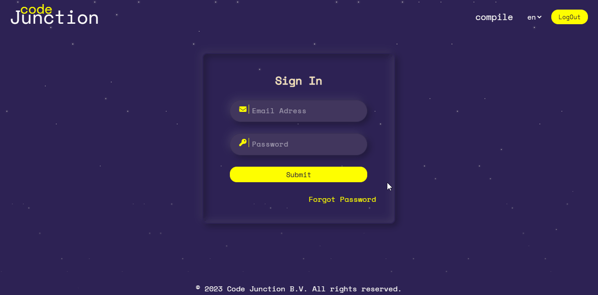

> Hello, world! This is the project’s summary that describes the project plain and simple, limited to the space available. 

**[PROJECT PHILOSOPHY](#project-philosophy) • [WIREFRAMES](#wireframes) • [TECH STACK](#tech-stack) • [IMPLEMENTATION](#implementation) • [HOW TO RUN?](#how-to-run)**

<br><br>

<!-- project philosophy -->


> Code Junction is a code collaboration platform designed to help developers improve their coding skills and work together more efficiently.

> Code Junction aims allows developers to collaborate on code in real-time, share their expertise, and solve problems together.

> Code Junction includes AI-powered code quality analysis tools that provide developers with feedback on their code, suggest improvements based on    best practices, and help them improve their skills over time.

> Code Junction makes learning to code more engaging and fun through gamification elements like points, and leaderboards.

### User Stories

- As a user, I want to code online with my colleagues while live sharing code editor.
- As a user, I want to code and compile my code and see result online.
- AS a user, I want to choose the programming language i prefer. 
- As a user, I want to be able to ask for ai advice to get rapid feedback on my code.
- As a user, I want to be able to save my codes.
- As a user, I want to have the ability to choose the language i prefer to read and interact with.
- As a user, I want to chat with other programmers while coding.
- As a user, I want to be able to track my progress and earn rewards for improving my coding skills.
- As a user, I want to check my programming activities through bar chart.

### Admin Stories

- As an admin, I want to be able to check openai api daily usage through bar chart and pie chart.
- As an admin, I want to be able to have the exact number of active users. 

<br><br>

<!-- Prototyping -->


> We designed Code Junction using wireframes and mockups, iterating on the design until we reached the ideal layout for easy navigation and a seamless user experience.

### Wireframes
| Sign Up | Forget Password | Ranking  | 
| ------ | ------ | ------ | 
|  |  |  |

| Code Editor | Activities | Admin |
| ------ | ------ | ------ | 
|  |  |  | 

### Mockups
| Sign Up | Forget Password | Ranking | 
| ----- | ----- |  ----- |
|  |  | 

| Code Editor | Activities | Admin  |
| ------ | ------ | ------ |
|  |  | 


<br><br>

<!-- Implementation -->


> Using the wireframes and mockups as a guide, we implemented the Code Junction app with the following features:

| landing Page  | Responsiveness |  
| ------ | ------ |
|  |  | 

| Sign Up  | Sign In |
| ------ | ------ |
|  |  |

| Forget Password | Create Session |
| ------ | ------ |
|  |   |

| Run Code | Save Code |
| ------ | ------ |
|  |  |

| AI Advice | AI Evaluation | 
| ------ | ------ |
|  |  | 

| Real time code collaboration | (AI) autocorrect |  
| ------ | ------ |
|  |  | 

| Online Chatting | Compiler Suggestions |
| ------ | ------ |
|  |  | 

| User Activities | User's Profile | 
| ------ | ------ |
|  |  | 

| Ranking Page | Admin Page (Chinese) | 
| ------ | ------ |
|  |  | 


<br><br>

<!-- Tech stack -->


###  Code Junction is built using the following technologies:

- This project uses the [React JS development framework](https://reactjs.org/). React is a declarative, efficient, and flexible JavaScript library for building SPA (single web application) and user interfaces or UI components. It lets you compose complex UIs from small and isolated pieces of code called “components”.

-For persistent storage (database), the app uses the [mongodb] which allows the app to store all data in different schema and handler the big data insid the app

-This project also uses [Framer-Motion] in order to animate components and add fun transitions between pages.

- 🚨 Currently, AI advice are not the best guide to rely on but hopefully very soon that will not be the case. This is a known issue that we are working to resolve!
- The app uses the font ["mono space"](https://fonts.googleapis.com/css2?family=Audiowide&display=swap) as its main font, and the design of the app adheres to the material design guidelines.

<br><br>

<!-- How to run -->


> To set up Code Junction locally, follow these steps:

### Prerequisites

This is an example of how to list things you need to use the software and how to install them.
* npm
  ```sh
  npm install npm@latest -g
  ```
-   Download and install from https://nodejs.org/en/download/

### Installation

_Below is an example of how you can instruct your audience on installing and setting up your app. This template doesn't rely on any external dependencies or services._

1. Get a free API Key at [https://Rapidapi.com](https://rapidapi.com/abdheshnayak/api/code-compiler/)

2. Get a free API Key at [https://openai.com]

3. Clone the repo
   ```sh
   git clone https://github.com/mohamad-kareem/CodeJunction.git
   ```
4. Install NPM packages
   ```sh
    cd /backend
    npm install
    cd /frontend
    npm install
   ```
5. Enter your API in `configs/ai.config.js`
   ```js
   const apikey = 'ENTER YOUR API';
   ```
6.  initialize App

    ````js
    //mobile
    npm start
    //server
    nodemon sever.js
    ````

Now, you should be able to run Code Junction Express locally and explore its features.